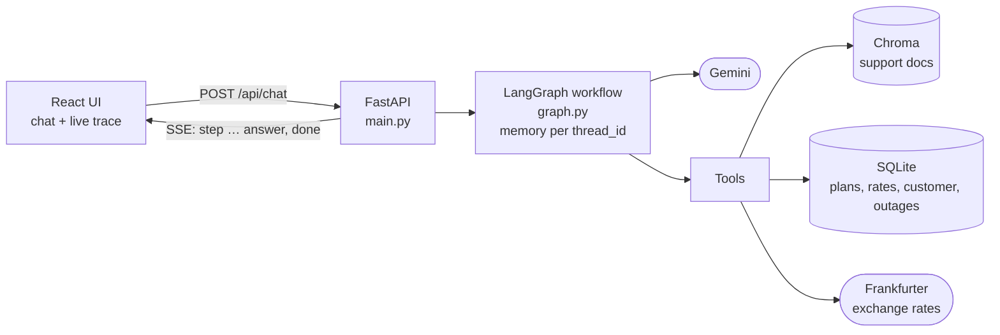
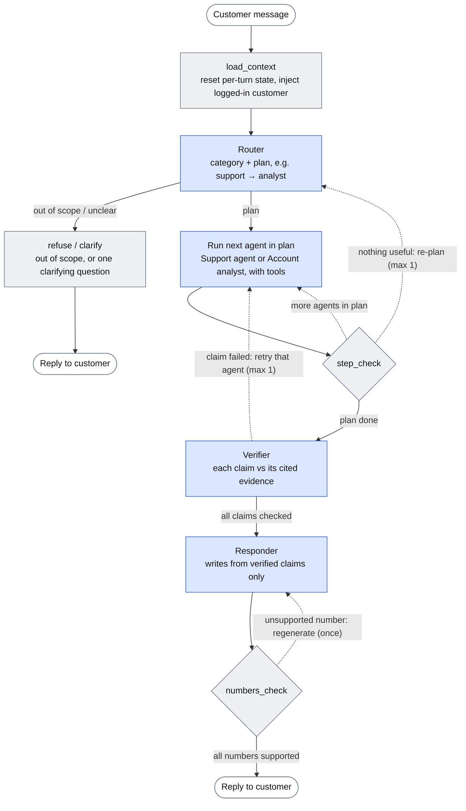
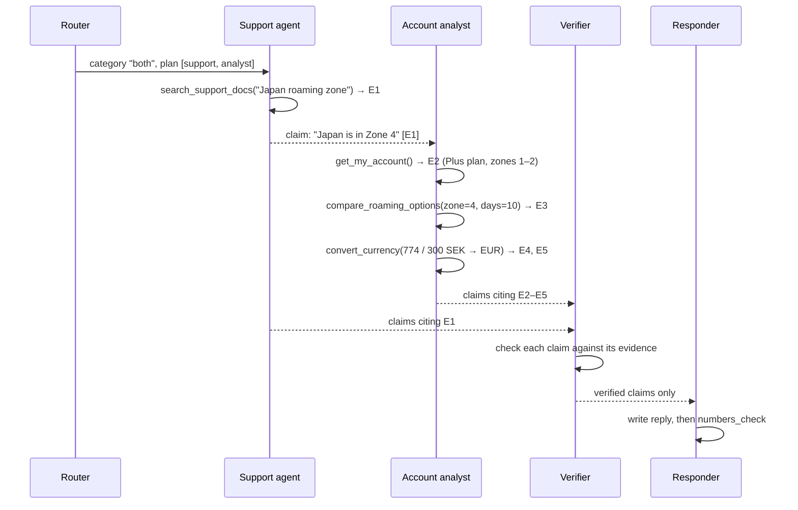

# multi-agent-telecom-support

A multi-agent customer support assistant for **Martins Mobile**, a fictional Swedish mobile
operator. Customers ask about plans, roaming, billing, refunds and connectivity problems. Several
agents work together behind a chat UI. A router decides which agents are needed. Each agent gathers
evidence with tools. A verifier checks every claim against that evidence before a reply is written.
The UI shows the whole process live.

All operator data (documents, plans, prices, the customer, outages) is fictional.

## How to run

**Prerequisites:** Python 3.11+, [uv](https://docs.astral.sh/uv/), Node.js 20+, and a free
[Gemini API key](https://aistudio.google.com/apikey).

```bash
# Backend (http://localhost:8000)
cd backend
cp .env.example .env          # then put your GOOGLE_API_KEY in .env
uv sync
uv run uvicorn app.main:app --reload
```

On first start the backend creates the SQLite database and indexes the support documents. That
first start downloads the ~80 MB embedding model once.

```bash
# Frontend (http://localhost:5173), in a second terminal
cd frontend
npm install
npm run dev
```

Open http://localhost:5173, pick a simulated customer in the top right, and click one of the
example questions.

**Other commands** (from `backend/`):

| Command | What it does |
|---|---|
| `uv run python -m app.cli -v --customer C-1003 "question" ["follow-up"]` | Run questions in the terminal as a given customer and print the trace |
| `uv run python -m app.data.seed` | Recreate the database |
| `uv run python -m app.rag.ingest` | Re-index the documents |

**Configuration** (`backend/.env`):

| Variable | Default | Purpose |
|---|---|---|
| `GOOGLE_API_KEY` | (required) | Gemini API key |
| `GEMINI_MODEL` | `gemini-3.5-flash-lite` | Model used by every agent |
| `GEMINI_REQUESTS_PER_MINUTE` | `14` | Client-side rate limit; raise it on a paid key |

## Technologies

| Area | Choice | Why |
|---|---|---|
| Agent framework | **LangGraph** | Explicit graph with conditional edges, shared state, checkpointer per conversation, node-level streaming |
| LLM | **Google Gemini** (`gemini-3.5-flash-lite`) via `langchain-google-genai` | Free tier, The lite model takes ~2 s per call vs 5–10 s for full Flash |
| Backend | **Python, FastAPI** | Async streaming responses (server-sent events) |
| RAG | **Chroma** + **all-MiniLM-L6-v2** (local ONNX embeddings) | Runs locally with no second API key, and without PyTorch |
| Structured data | **SQLite** | Plans, roaming rates, Travel Passes, the customer, outages |
| Public API | **Frankfurter** (ECB exchange rates) | Currency conversion, no key |
| Frontend | **React 19 + Vite** | Chat UI with a live, expandable agent trace |

## Architecture

### System overview



### Agent workflow (one turn)

Read top to bottom. Solid arrows are the normal path; dotted arrows are the bounded loops. Blue
nodes call the LLM; grey nodes are plain code, so every routing decision after the first is cheap
and deterministic.



### Example: how the agents work together

"I'm going to Japan for 10 days. What would roaming cost on my plan, in euros, and is there a
cheaper option?"



Code layout (`backend/app/`):

| Path | Contents |
|---|---|
| `graph.py` | Graph wiring and the plain-code nodes (`load_context`, `step_check`, `numbers_check`, `refuse`, `clarify`) |
| `agents/` | `router`, `support`, `analyst`, `verifier`, `responder`; `worker.py` is the shared tool loop; `tools.py` is what the LLM sees |
| `checks.py` | Pure decision functions (next step, status normalization, number extraction), unit-tested |
| `tools/` | `kb.py` (RAG search), `account.py` (fixed SQL queries), `roaming.py` (trip cost comparison), `calculator.py`, `currency.py` |
| `rag/` | Heading-based chunking and the Chroma store |
| `data/` | Database seed; `backend/data/docs/` holds the six knowledge base documents |
| `state.py` | Graph state. Only messages carry over between turns; everything else is reset each turn |

## Agents and their responsibilities

| Agent | Responsibility | Tools |
|---|---|---|
| **Router** | Classifies the message (policy, troubleshooting, account, both, unclear, out_of_scope) and outputs an ordered plan of agents. Called again only to re-plan when an agent finds nothing | none |
| **Support agent** | Policy and troubleshooting from the knowledge base: roaming zones and which countries are in them, fair use, Travel Pass rules, billing, refunds, troubleshooting steps, outages | `search_support_docs`, `get_outages` |
| **Account analyst** | The customer's account, plans and prices, roaming rates, trip cost comparison, calculations, currency conversion | `get_my_account`, `find_plans`, `get_roaming_rate`, `compare_roaming_options`, `cost_calculator`, `convert_currency` |
| **Verifier** | Checks every claim against the evidence it cites before anything reaches the customer | none |
| **Responder** | Writes the reply using only verified claims, with no new facts or arithmetic | none |

Each agent gets only its own tools, which keeps the roles distinct. Only the support agent can
find out which zone a country belongs to, because zone membership is policy text in the
documents. Prices are only in SQLite. So a trip-cost question genuinely needs both agents, in
that order.

## Tools and RAG

**Knowledge base (RAG).** Six markdown documents (`backend/data/docs/`: roaming, plans, billing,
refunds, troubleshooting, customer service) are split into **one chunk per heading section**,
33 chunks in total.
- Each chunk keeps its source file, heading path and a stable ID as metadata.
- The heading path is prepended to the text before embedding, so a section titled "Zone 4" is
  embedded as "Roaming > Zone 4: Asia-Pacific …".
- Each zone's country list sits in the same section as its conditions.
- Search returns the top 4 chunks within a cosine-distance cutoff of 0.75. If nothing passes, the
  support agent reports `no_relevant_info`, which can trigger a re-plan. The cutoff was measured,
  not guessed: relevant hits reached 0.71 ("my internet is not working"), and the closest
  off-topic hit was 0.78 ("capital of France"). Re-measured after adding Zone 5: "Which zone is
  Brazil in?" finds the new section at 0.30, and a new off-topic probe ("best football team in
  Argentina?") scores 0.81 and is filtered out.

**Structured data.** Fixed query functions, never free-form SQL written by the LLM.

**Trip cost comparison** (`compare_roaming_options`). The question "which option is cheapest" is
answered in **code**, not by the LLM:
- **Usage estimate:** the trip's data use is estimated from the customer's typical monthly usage,
  unless they state their own.
- **Pay-as-you-go:** priced at the zone's rate per GB.
- **Travel Passes:** repeated to cover the trip's days, with pay-as-you-go for any data beyond the
  pass.
- **Plan upgrades:** priced at the monthly difference (an upper bound, since you can downgrade
  after the trip).
- **Result:** the options sorted by cost, with the cheapest one marked.

The analyst reports this result, so its claim "the cheapest option is…" cites evidence that
literally says so. This tool was added after testing: when the analyst compared the options
itself, it chose wrongly in 3 of 3 runs, and the verifier (same model) passed all of them.

**Calculator.** Arithmetic expressions are evaluated from a parsed syntax tree, allowing only
numbers, `+ - * /`, brackets, `min`, `max` and `round`. `eval` is never used.

**Currency.** The Frankfurter API with a 5 s timeout. Failures become error results, not crashes.

## How the agents coordinate

**Dynamic decisions.**

| Decision | Made by |
|---|---|
| Which agents run, and in what order | Router (LLM), once per turn |
| Ask a clarifying question, or refuse | Router (LLM) |
| Move on, re-plan, or go to verification | `step_check` (plain code, based on each agent's status) |
| Which tools to call, and how many times | Each agent (LLM), up to 3 tool rounds |
| Whether a claim is supported | Verifier (LLM) |
| Which agent to retry, with what feedback | Verifier node (code, from the failed claims) |
| Whether the reply's numbers can be trusted | `numbers_check` (code) |

**Plan once, check in code.** The Router makes one LLM call per turn. After each agent, plain code
decides the next step, and the Router is only called again (at most once) if an agent returns
`no_relevant_info` or `error`. A valid empty result such as "no outages in your area" is status
`ok_empty` and does not trigger a re-plan.

**Shared state, not agent-to-agent messages.** Agents communicate through the graph state.
- The support agent's findings are passed to the analyst, e.g. "Japan is in Roaming Zone 4".
- Every tool output is recorded **by code** as evidence with an ID (`E1`, `E2`, …).
- Agents report structured claims that cite those IDs.

**Verification and retries.**
- **Code pre-checks:** code first rejects claims that cite no evidence or cite IDs that don't
  exist.
- **LLM check:** the verifier then judges each claim against the cited raw tool outputs.
- **Retry:** a failed claim makes only the agent that produced it run again, once. It receives the
  claim, the reason and the evidence it contradicts, and its new claims are verified again.
- **Retry also fails:** the claim is removed, and the reply says that part couldn't be confirmed.
- **Policy violations:** claims that promise refunds, plan changes or other customers' data are
  never shown. They're replaced by a referral to customer service.

**Reply and numbers check.** The responder writes from verified claims only. Code then extracts
every number in the reply and checks that each one appears in a verified claim (or in the
customer's message). On a mismatch the reply is regenerated once. If it still fails, the verified
claims themselves become the reply. Because of this check, all arithmetic must happen in tools:
the responder isn't allowed to compute totals or differences.

**Customer identity is set by code.** The UI simulates a login: you pick one of five demo
customers, and the frontend sends that `customer_id` with each message.
- **Validated by the API:** an unknown customer is rejected (422).
- **Loaded into state by code:** `load_context` loads the account. Account tools take no customer
  argument; they read the ID from state, so the LLM can't query anyone else's account, even if a
  message asks it to.
- **One customer per conversation:** switching customer in the UI starts a new chat. The API
  enforces this too: a message for a conversation that belongs to another customer is rejected
  (409), so history never crosses customers.
- In production the customer would come from an authenticated session instead of the browser.

| Customer | Plan (zones) | Area | Data used / typical per month | Try |
|---|---|---|---|---|
| Alex Demo (C-1001) | Plus 30 GB (1–2) | Uppsala | 12.4 / 18 GB | Japan trip comparison; ongoing outage |
| Sara Demo (C-1002) | Bas 10 GB (1) | Malmö | 9.6 / 11 GB | Almost out of data; even Zone 2 costs extra |
| Johan Demo (C-1003) | World 150 GB (1–4) | Stockholm | 40 / 60 GB | Japan already included; planned maintenance |
| Lina Demo (C-1004) | Max 100 GB (1–3) | Kiruna | 30 / 45 GB | USA included, Thailand not; 5G outage |
| Omar Demo (C-1005) | Bas 10 GB (1) | Göteborg | 10 / 8 GB | Allowance used up; ongoing outage |

**Conversation state.** LangGraph's `MemorySaver`, keyed by a `thread_id` that the frontend
generates. Only the message history carries over between turns, so follow-ups like "and what
about Thailand?" work. The plan, evidence, claims, counters and draft are reset at the start of
every turn, so old evidence can't leak into a new answer unverified.

**Bounds.**
- **Limits:** at most 1 re-plan per turn, 1 retry per agent, 3 tool rounds per agent run and 1
  reply regeneration.
- **Backstop:** LangGraph's `recursion_limit` (25 steps) in case the code's own counters have a
  bug.
- **Observed cost:** a typical two-agent question takes 7–9 LLM calls. The theoretical worst case
  (re-plan plus two retries) is about 36.
- **Speed:** the free tier allows 15 requests per minute for this model. A client-side rate
  limiter spaces the calls out, so a two-agent question takes about 40 s. The UI streams each step
  as it finishes, so you can watch progress instead of a frozen screen. Simple questions take
  5–25 s, and refusals take one call.

## Example questions

Logged in as Alex Demo unless stated otherwise.

| Demonstrates | Question | Expected path |
|---|---|---|
| RAG | "What's the fair-use policy when roaming in the EU?" | policy → support → verifier → responder |
| RAG | "Can I get a refund for a Travel Pass I bought but never used?" | policy → support (refund policy) |
| Tool use | "How much data do I have left this month?" | account → analyst (`get_my_account`) |
| Tool use + troubleshooting | "My mobile data is really slow at home today, what's going on?" | troubleshooting → support (`get_outages` finds the Uppsala outage) |
| **Multi-agent** | "I'm going to Japan for 10 days next month. What would roaming cost me on my current plan, in euros, and is there a cheaper option?" | both → support (Japan = Zone 4) → analyst (`compare_roaming_options`, `convert_currency`) → verifier → responder. Answer: pay-as-you-go 774 SEK; cheapest is upgrading to World for a month, +300 SEK |
| Follow-up (conversation state) | then: "And what about Thailand for 5 days?" | both → … cheapest is the 7-day Travel Pass, 249 SEK |
| Zone 5, passes only | "What's the cheapest way to use data in Brazil for a week?" | both → support (Brazil = Zone 5) → analyst. Cheapest: the 7-day pass plus 1.2 GB pay-as-you-go, 513.8 SEK |
| Different customer | As Johan Demo: "I'm going to Japan for 10 days. What will roaming cost me?" | both → … Zone 4 is included in World: 0 SEK |
| Different customer | As Omar Demo: "How much data do I have left this month?" | account → analyst: 0 GB of 10 GB |
| Clarification | "It doesn't work" (in a new chat) | unclear → one clarifying question |
| Out of scope | "Write me a poem about cats" | out_of_scope → refusal, 1 LLM call |

## Testing

`uv run pytest` runs 69 tests without calling the LLM:
- **Calculator:** results, and rejection of code injection and exponent bombs.
- **Currency:** a mocked HTTP layer, including outage, timeout and unknown-currency cases.
- **Account queries:** run against a temporary database, including every demo customer and Zone 5.
- **Trip cost comparison.**
- **Chunking.**
- **Step check:** the routing decisions.
- **Numbers check:** e.g. the responder computing 774 − 399 by itself gets caught.
- **API:** event order, truncation, rate-limit and timeout handling, unknown customers, and a
  conversation that tries to switch customer, using a fake graph.

The LLM-driven paths were checked by running the example questions end to end (CLI and browser).

## Known limitations

- **Retry and re-plan paths:** the retry path has run live once (the Verifier failed a support
  claim for Johan's Japan question, and the retried claim passed). The re-plan path has only
  been exercised by unit tests.
- **Simulated login:** the selected customer is trusted from the browser, a stand-in for real
  authentication.
- **Restart:** state is in memory. After a backend restart the UI still shows old messages, but
  the backend has no history for that thread.
- **Simplifications in the trip comparison:** the Zone 4 fair-use limit (20 GB/month) is not
  applied, and upgrade cost is the full monthly difference, an upper bound.
- **Retrieval cutoff margin:** the gap is narrow (0.71 relevant vs 0.78 off-topic) on a small
  corpus.
- **One model for every role:** the verifier shares blind spots with the agents it checks. That's
  why decisions (trip comparison, arithmetic, number checks) were moved into code wherever
  possible.

## What I would improve with more time

- **Build a stronger test and evaluation suite**, since the current tests and evaluation were written by Claude (with instructions from me). They did catch some faults and errors in the system. However, AI agents have a tendency to write tests and evaluations that are biased towards the code/system, so an overhaul and extension would be necessary to remove that bias.

- **Replace the verifier agent with a stronger model**, since the same model used for the analyst and support agent will make the same mistakes. A different, more capable model is less likely to make the same mistakes and more likely to catch the faulty ones. This happened during testing, where the analyst picked the wrong option and the verifier passed it.

- **Move more checks into code**, for example matching zone claims against a zone table and plan claims against the database. A decision made in code doesn't need the LLM to verify it.

- **Use TypeSafe AI (Jev) as the router, and perhaps for verification:** Jev returns typed judgments with probabilities instead of generated text. As the router, a choice between the six categories would give a confidence per category, and low confidence could trigger a clarifying question. As the verifier, it could give a true/false judgment per claim with a probability, and uncertain claims could be retried. It could also be used to evaluate retrieval. I kept it out so that only one API key is needed, and because it is a very new, untested model released barely a month ago.

- **Implement hybrid search, a reranker and retrieval evaluation for RAG** to improve RAG as the amount of data increases. During testing, the relevance cutoff sat in a narrow gap: the least similar relevant result scored 0.71 and the closest off-topic result scored 0.78, with only 6 documents. An increase in data will therefore probably result in more false "nothing found" results.

- **Use a paid tier/higher rate limit:** the biggest reason for slow answers is the 15 requests/minute limit on the free tier of the Gemini 3.5 Flash Lite model, and the limit is only 5 requests/minute on Gemini 3.8 Flash.

- **Observability with LangSmith** to trace everything and store the traces. The current version only shows the trace in the UI for one request, and it is lost afterwards.
